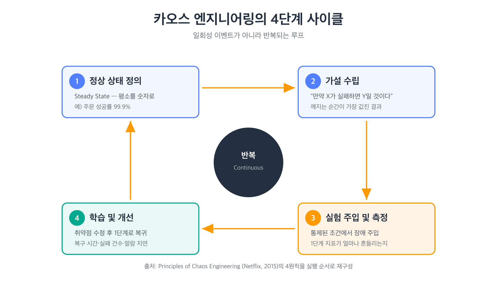
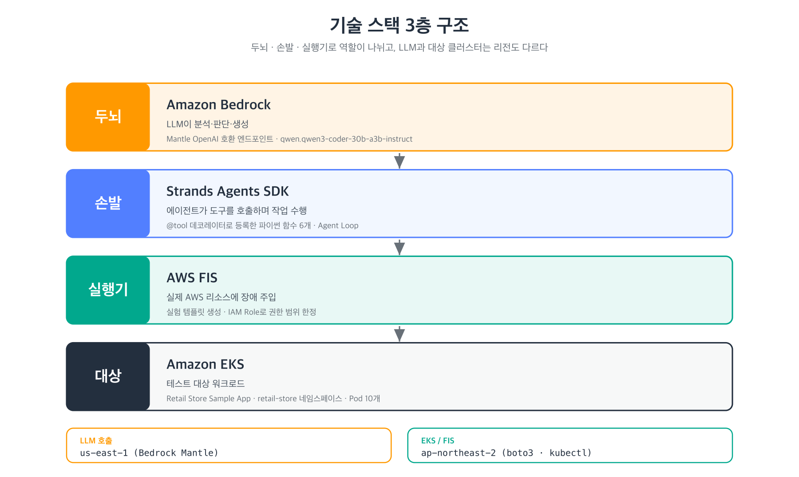
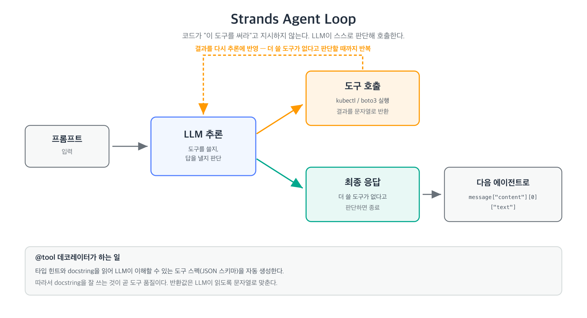
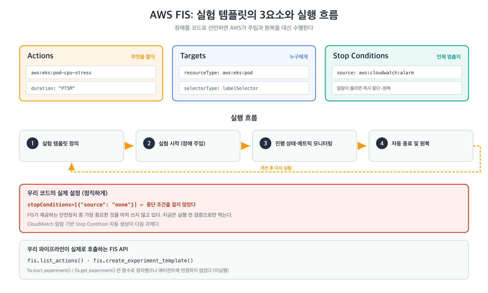
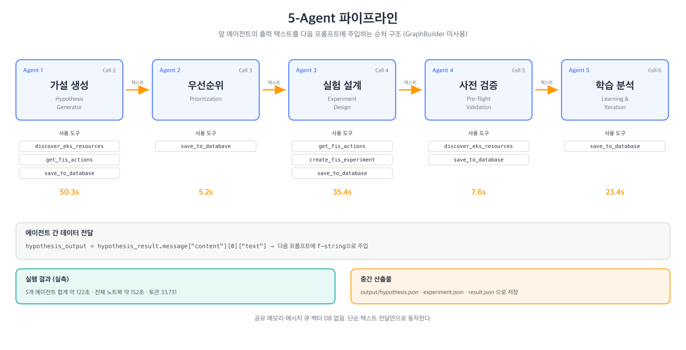
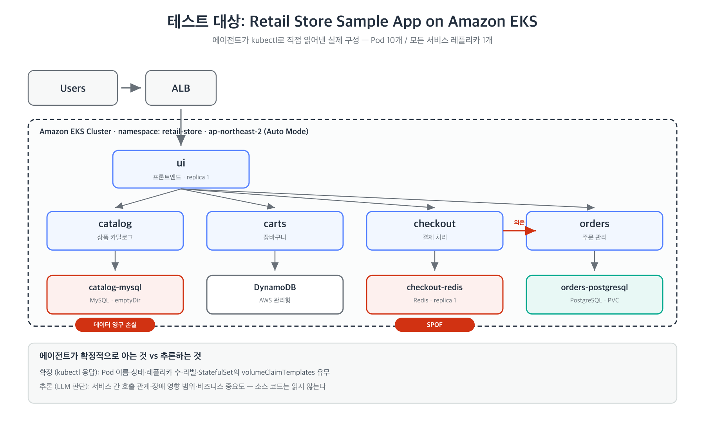

# 발표 소스: 카오스 엔지니어링에서 Multi-Agent 자동화까지

> **상태: 초안(Draft v0.3) — 2026-09-16 작성** — PPT 제작용 원본 스크립트.
> 슬라이드 단위로 "제목 / 핵심 메시지 / 화면에 넣을 것 / 말할 내용(스피커 노트)"을 정리한다.
> `<!-- TBD -->` 표시는 확정이 필요한 항목.
>
> **읽을 거리**는 발표자가 내용을 더 파악하기 위한 참고 링크다. 슬라이드에 넣는 용도가 아니다.
> 모든 링크는 2026-09-16 기준으로 접속 확인했다.
>
> **도식 이미지**는 `docs/images/` 에 SVG와 PNG로 함께 있다.
> 문구를 고치려면 `docs/images/generate_diagrams.py` 를 수정하고 다시 실행한다.
> PPT에는 SVG를 넣는 편이 좋다 (PowerPoint·Keynote에서 도형으로 변환해 편집 가능).
>
> **v0.3 변경 — 발표 구조를 5부로 재편했다.**
> ① AWS Summit 이야기를 오프닝에서 Part 3 도입부로 옮겼다 (기술 소개의 출발점 역할)
> ② 기술 소개(Bedrock·Strands·FIS)를 5-Agent 파이프라인보다 **앞으로** 배치했다
> ③ Part 2에 "무엇이 어려운가 — 심리·조직 장벽"을 추가했다
> ④ Part 4에 **"실제 트래픽이 없었다"는 한계와 그 반박**을 2장으로 신설했다

---

## 발표 메타 정보

| 항목 | 내용 |
|---|---|
| 제목(안) | 실패를 설계하다 — AI 에이전트와 함께하는 카오스 엔지니어링 |
| 부제(안) | AWS Summit Seoul 2026에서 본 Multi-Agent Chaos Engineering, AI-Hackathon 에서 구현해보기 |
| 대상 청중 | 사내 개발팀 / 인프라팀 |
| 프로젝트 성격 | **AI Hackathon 토이 프로젝트.** 운영 환경 적용이 아니다. 해커톤용 테스트 EKS 클러스터 + AWS 공식 샘플 앱 |
| 발표 시간 | 20~30분 (아래 배분은 29분 기준 / 슬라이드 36장) |
| 청중 사전 지식 | 쿠버네티스는 알지만 카오스 엔지니어링·AI 에이전트는 처음이라고 가정 |
| 한 줄 핵심 메시지 | "장애는 막을 수 없다. 하지만 AI와 함께라면 미리 겪어볼 수 있다." |
| 발표 톤 | 성과 발표가 아니라 **"보고, 해커톤에서 만들어보니 이랬다"** 는 경험 공유. 안 된 것도 그대로 말한다 |
| 데모 | 사전 녹화 영상 (라이브 실행 안 함) |

### 전체 구조

| Part | 내용 | 슬라이드 | 시간 |
|---|---|---|---|
| — | 오프닝 | 1~2 | 1.5분 |
| **1** | 카오스 엔지니어링이란 무엇인가 — 넷플릭스에서 지금까지 | 3~9 | 6분 |
| **2** | 그런데 왜 아무도 안 하는가 — 무엇이 어려운가 | 10~12 | 3분 |
| **3** | AWS Summit Seoul 2026에서 본 Multi-Agent 활용 | 13~29 | 12.5분 |
| **4** | 배운 것과 한계 | 30~32 | 3분 |
| **5** | 다음 단계와 마무리 | 33~36 | 3분 |
| | **합계** | **36장** | **약 29분** |

Part 3은 분량이 크므로 네 덩어리로 나눠서 진행한다.

| 구간 | 내용 | 슬라이드 |
|---|---|---|
| 3-1 | 출발점 — Summit에서 보고, 해커톤에서 만들어봤다 | 13 |
| 3-2 | 기술 소개 — Strands Agents + Amazon Bedrock + AWS FIS | 14~19 |
| 3-3 | 해결 접근 — 5-Agent 파이프라인 | 20~24 |
| 3-4 | 아키텍처 — 테스트 대상 | 25 |
| 3-5 | 실제로 돌려본 결과 + 데모 | 26~29 |

### 시간이 부족할 때 빼는 순서

| 순서 | 뺄 슬라이드 | 이유 |
|---|---|---|
| 1 | Slide 19 (왜 kubectl이 아니라 FIS) | Q&A로 넘길 수 있다 |
| 2 | Slide 6 (일반 테스트와의 비교) | 개념 이해에 필수는 아니다 |
| 3 | Slide 24 (도구 6개와 코드) | 기술 청중이 아니면 생략 |
| 4 | Slide 12 (심리·조직 장벽) | Part 2를 2장으로 압축 |

4장을 다 빼면 32장 / 약 25분. **30분을 받으면** 아무것도 빼지 않고 Q&A를 5분 확보한다.

---

# 오프닝

## Slide 1 — 타이틀

**핵심 메시지**: 이 발표는 "장애를 없애는 법"이 아니라 "장애를 일부러 만드는 법"에 대한 이야기다.

**화면**
- 제목: 실패를 설계하다
- 부제: AWS Summit Seoul 2026에서 본 Multi-Agent Chaos Engineering, AI-Hackathon 에서 구현해보기
- 발표자 / 소속 / 날짜 <!-- TBD -->

**스피커 노트**
> 오늘 제가 할 이야기는 시스템을 안정적으로 만드는 방법이 아닙니다. 오히려 시스템을 일부러 고장 내는 이야기입니다. 그리고 그 고장을 AI 에이전트가 알아서 설계하게 만들어본 과정을 공유하려고 합니다.

---

## Slide 2 — 질문으로 시작

**핵심 메시지**: 청중이 스스로 "모르겠다"를 자각하게 만든다.

**화면** (질문 3개만 크게)
- 지금 운영 중인 서비스에서 Pod 하나가 죽으면, 몇 초 안에 복구됩니까?
- 그 답을 **측정해서** 알고 있습니까, **아마 그럴 것이라고** 믿고 있습니까?
- 마지막으로 확인한 게 언제입니까?

**스피커 노트**
> 대부분은 "아마 괜찮을 것"이라고 답합니다. 문서에는 그렇게 쓰여 있고, 설계도 그렇게 했으니까요. 문제는 "아마"와 "확인했다" 사이의 간격입니다. 그 간격에서 장애가 터집니다. 카오스 엔지니어링은 그 간격을 없애는 작업입니다.

---

# PART 1. 카오스 엔지니어링이란 무엇인가

> **이 파트의 줄기: 넷플릭스에서 시작해 지금까지 어떻게 왔는지.**
> 청중이 여기서 이해를 놓치면 뒤의 AI 이야기는 전부 공중에 뜬다.

## Slide 3 — 정의

**핵심 메시지**: 카오스 엔지니어링은 "고장 내기"가 아니라 "가설을 세우고 검증하는 실험"이다.

**화면**
- 한 줄 정의: **시스템이 운영 환경의 격렬한 조건을 견뎌낼 수 있다는 자신감을 얻기 위해, 시스템을 대상으로 실험하는 규율**
  - 출처: 넷플릭스, [Principles of Chaos Engineering](https://principlesofchaos.org/) (2015)
- 키워드 3개 강조: **가설 기반 / 통제된 / 반복 가능한**
- 용어를 만든 곳도 넷플릭스 — 어떻게 여기까지 왔는지는 바로 다음 슬라이드

**스피커 노트**
> 이 정의는 제가 만든 게 아니고 넷플릭스가 2015년에 정리해 공개한 문장입니다. 이 분야의 용어 자체가 넷플릭스에서 나왔습니다.
>
> 이름 때문에 오해가 많습니다. "운영 서버를 랜덤하게 때려 부순다"가 아닙니다. 과학 실험과 구조가 똑같습니다. 가설을 세우고, 조건을 통제하고, 결과를 측정하고, 배웁니다. 다른 점은 실험 대상이 시험관이 아니라 우리 프로덕션 시스템이라는 것뿐입니다.

**읽을 거리**
- [Principles of Chaos Engineering](https://principlesofchaos.org/) — 원문 정의와 4원칙. 페이지 짧으니 통째로 읽을 만함
- [Chaos Engineering (IEEE Software, 2016)](https://arxiv.org/abs/1702.05843) — 넷플릭스 엔지니어들이 쓴 논문. 원칙의 근거와 실제 운영 방식까지

---

## Slide 4 — 넷플릭스에서 시작해 지금까지

**핵심 메시지**: 15년의 흐름을 한 문장으로 요약하면 **"무작위 파괴 → 설계된 실험 → 관리형 서비스"** 다. 그래서 지금이 시작하기 가장 쉬운 시점이다.

**화면** (발전 흐름 — 각 단계가 무엇을 해결했나)

| 시점 | 단계 | 이 단계가 해결한 것 |
|---|---|---|
| 2010 | **Chaos Monkey** — 운영 인스턴스를 무작위로 죽이는 도구 하나 | "장애를 기다리지 말고 우리가 먼저 만들자"는 발상의 전환 |
| 2011 | **Simian Army** — Latency Monkey(지연), Conformity Monkey(규칙 위반 탐지), **Chaos Gorilla**(AZ 전체 장애)로 확장 | 장애 **유형**과 **폭발 반경**의 확장. 인스턴스 하나에서 가용영역 전체까지 |
| 2012 | Chaos Monkey 오픈소스 공개 | 넷플릭스 밖의 회사도 쓸 수 있게 됨 |
| 2015 | **Chaos Engineering** — 용어와 [Principles of Chaos Engineering](https://principlesofchaos.org/) 정립 | 도구가 **방법론**이 됨. 무작위 파괴에서 **설계된 실험**으로 |
| 2021.03 | **AWS FIS** 정식 출시 (Gremlin, Chaos Mesh 등도) | 도구를 직접 만들 필요가 없어짐. 권한 통제·중단 조건·이력이 서비스 기본 기능으로 |

- 도구가 공짜가 된 지금, 남은 병목은 **"그래서 무엇을 실험할 것인가"**
- 핵심 태도: **업무 시간에** 일부러 돌렸다

**스피커 노트**
> 시작은 2010년입니다. 넷플릭스가 자체 데이터센터에서 AWS로 옮기던 시기인데, 클라우드에서는 인스턴스가 언제든 사라질 수 있다는 걸 받아들여야 했습니다. 그래서 "어차피 죽을 거면 우리가 먼저 죽이자"는 발상으로 Chaos Monkey를 만들었습니다. 업무 시간에 돌렸습니다. 새벽에 터지면 대응할 사람이 없으니 사람이 다 붙어 있을 때 일부러 터뜨린 겁니다.
>
> 2011년에는 원숭이가 군단이 됩니다. 이름이 재미있는데, Latency Monkey는 네트워크를 느리게 만들고 Chaos Gorilla는 가용영역을 통째로 날립니다. 원숭이에서 고릴라로 커진 겁니다. 장애의 종류와 범위가 넓어진 단계입니다.
>
> 2015년이 가장 중요한 전환입니다. 도구가 방법론이 됩니다. 넷플릭스가 "Chaos라는 말이 팀마다 다른 뜻으로 쓰인다"는 문제를 느끼고 원칙을 정리했고, 이때 가설과 정상 상태 같은 개념이 들어옵니다.
>
> 마지막 줄이 저희에게 직접적인 의미가 있습니다. 2021년에 AWS FIS가 나오면서 도구를 직접 만들 필요가 없어졌습니다. 그런데 도구가 공짜가 되니까 남은 병목이 드러났습니다. **"그래서 뭘 실험할 건데?"** 입니다. 이 질문이 오늘 발표의 중심입니다.

**읽을 거리**
- [The Netflix Simian Army (2011)](https://netflixtechblog.com/the-netflix-simian-army-16e57fbab116) — 원숭이 군단 각각이 무슨 장애를 내는지. "업무 시간에 돌린다"는 대목도 여기
- [Chaos Engineering Upgraded (2015)](https://netflixtechblog.com/chaos-engineering-upgraded-878d341f15fa) — 도구에서 방법론으로 넘어간 전환점
- [Netflix/chaosmonkey](https://github.com/Netflix/chaosmonkey) — 실제 구현 코드
- [AWS FIS 출시 블로그 (2021.03)](https://aws.amazon.com/blogs/aws/aws-fault-injection-simulator-use-controlled-experiments-to-boost-resilience/) — 처음부터 EKS와 Stop Condition을 포함해 출시했다

---

## Slide 5 — 왜 필요한가: Everything fails all the time

**핵심 메시지**: 장애는 예외가 아니라 상수다. 그래서 "장애 없는 시스템"이 아니라 "장애를 흡수하는 시스템"을 만들어야 한다.

**화면**
- 인용: **"Everything fails all the time."**
  — Werner Vogels (CTO, Amazon), The Next Web Conference 키노트 "Uncertainty", 2008
  - 원래 발언은 이어지는 문장까지가 한 덩어리: *"We lose whole datacenters! Those things happen."*
- 인용: **"We needed to build systems that embrace failure as a natural occurrence."**
  — Werner Vogels, [10 Lessons from 10 Years of AWS](https://www.allthingsdistributed.com/2016/03/10-lessons-from-10-years-of-aws.html), 2016
- 공유 책임 모델
  - AWS: Reliability **of** the Cloud
  - 우리: Reliability **in** the Cloud

**스피커 노트**
> AWS가 EKS 컨트롤 플레인의 가용성을 보장해 줍니다. 하지만 그 위에 올린 우리 마이크로서비스가 Redis Pod 하나 죽었을 때 결제 전체가 멈추는지는 AWS가 알려주지 않습니다. 그건 우리 책임 영역이고, 우리가 직접 실험해서 확인해야 하는 부분입니다.
>
> 참고로 이 말을 한 Werner Vogels가 11년 뒤에 AWS FIS를 발표합니다. 그 자리에서 "카오스 엔지니어링은 아마존이나 넷플릭스 같은 회사만의 것이 아니라 모두의 것"이라고 말했습니다. 진입 장벽을 낮추겠다는 게 FIS의 출발점이었습니다.

**읽을 거리**
- [Werner Vogels: "Everything fails all the time" (The Next Web, 2008.04)](https://thenextweb.com/news/werner-vogels-everything-fails-all-the-time) — 이 발언이 나온 키노트 현장 기록. **인용 출처로 쓸 링크**
- ['Everything Fails All the Time' (Communications of the ACM, 2020)](https://cacm.acm.org/opinion/everything-fails-all-the-time/) — 이 문장이 그의 트레이드마크가 된 과정
- [10 Lessons from 10 Years of AWS](https://www.allthingsdistributed.com/2016/03/10-lessons-from-10-years-of-aws.html) — 2번 항목 "Expect the unexpected"에 두 번째 인용구가 그대로 나옴
- [AWS introduces new Chaos Engineering as a Service offering (TechCrunch, 2020.12)](https://techcrunch.com/2020/12/15/aws-introduces-new-chaos-engineering-as-a-service-offering/) — "chaos engineering is for everyone" 발언 출처
- [AWS 공유 책임 모델](https://aws.amazon.com/compliance/shared-responsibility-model/)

<!-- 인용 출처 확인 기록 (2026-09-16)
     "Everything fails all the time"은 2008년 The Next Web 키노트 발언이며, 블로그 글에는 없다.
     블로그 글(2016)의 표현은 "Failures are a given and everything will eventually fail over time".
     두 인용은 출처가 다르므로 한 곳으로 묶어 표기하지 말 것. -->

---

## Slide 6 — 일반 테스트와 무엇이 다른가 〔시간 부족 시 생략 가능〕

**핵심 메시지**: 유닛테스트는 "코드가 맞게 동작하는가", 카오스 실험은 "시스템이 틀린 상황에서 버티는가"를 본다.

**화면** (비교 표)

| | 단위/통합 테스트 | 카오스 실험 |
|---|---|---|
| 검증 대상 | 코드 로직 | 시스템 전체 거동 |
| 환경 | 격리된 테스트 환경 | 실제(또는 실제에 가까운) 환경 |
| 질문 | "의도한 대로 동작하나?" | "의도 밖의 일이 생기면 어떻게 되나?" |
| 실패의 의미 | 버그 | **아직 몰랐던 취약점** |
| 알 수 있는 것 | 정답 여부 | 복구 시간, 연쇄 장애 범위, 알람 동작 |

**스피커 노트**
> 핵심 차이는 "실패가 나쁜 게 아니다"라는 점입니다. 카오스 실험에서 가설이 깨지는 순간이 가장 값진 순간입니다. 운영 중에 새벽 3시에 알게 될 사실을, 낮에 준비된 상태로 알게 되는 거니까요.

---

## Slide 7 — 카오스 엔지니어링의 4단계 사이클

**핵심 메시지**: 카오스 엔지니어링은 이벤트가 아니라 반복되는 루프다. (→ Part 3의 5-Agent 파이프라인의 뼈대)

**화면** — `images/01-chaos-cycle.svg`



- Principles of Chaos Engineering의 4원칙(정상 상태 가설 / 실제 사건 재현 / 운영 환경 실험 / 지속 자동화)을 실행 순서로 풀어낸 것

**스피커 노트**
> 4단계입니다. 첫째, 평소 정상 상태를 숫자로 정의합니다. 주문 성공률 99.9% 같은 거요. 둘째, 가설을 세웁니다. 셋째, 장애를 주입하고 정상 상태 지표가 어떻게 흔들리는지 봅니다. 넷째, 배운 것을 고치고 다시 돌아갑니다.
>
> 이 4단계를 기억해 주세요. Part 3에서 이 단계 하나하나를 AI 에이전트에게 맡길 겁니다. 그리고 Part 4에서 저희가 1단계를 못 채웠다는 얘기를 하게 됩니다. 오늘 발표에서 가장 중요한 한계가 거기서 나옵니다.

**읽을 거리**
- [Well-Architected 신뢰성 기둥 — 장애 주입으로 복원력 테스트(REL12)](https://docs.aws.amazon.com/wellarchitected/latest/reliability-pillar/rel_testing_resiliency_fault_injection_resiliency.html) — AWS가 권장하는 실험 절차
- [Well-Architected 신뢰성 기둥 전체](https://docs.aws.amazon.com/wellarchitected/latest/reliability-pillar/welcome.html) — RTO/RPO 등 목표 설정 부분

---

## Slide 8 — 구체적인 예시 3개

**핵심 메시지**: 추상적인 개념을 청중이 자기 시스템으로 번역할 수 있게 만든다.

**화면** (가설 → 실험 → 확인할 것)

| 가설 | 주입할 장애 | 확인할 것 |
|---|---|---|
| 주문 Pod이 죽어도 30초 내 자동 복구된다 | Pod 강제 삭제 | 실제 복구 시간, 그 사이 실패한 요청 수 |
| DB에 CPU 부하가 걸려도 다른 서비스는 정상이다 | CPU 90% 스트레스 | 연쇄 지연 발생 여부, 서킷 브레이커 동작 |
| 네트워크가 느려지면 타임아웃으로 빠르게 실패한다 | 지연 3초 주입 | 스레드 고갈 여부, 사용자 체감 응답 시간 |

**스피커 노트**
> 오른쪽 열이 중요합니다. 카오스 실험의 산출물은 "장애가 났다/안 났다"가 아니라 숫자입니다. 복구까지 몇 초, 그 사이 몇 건 실패, 알람은 몇 초 후 울렸는지. 이 숫자가 없으면 개선했는지도 알 수 없습니다.
>
> 오른쪽 열을 눈여겨봐 주세요. "실패한 요청 수", "사용자 체감 응답 시간" 같은 건 **트래픽이 있어야** 측정됩니다. 이게 Part 4에서 다룰 저희의 가장 큰 한계입니다.

---

## Slide 9 — 안전장치 없는 카오스는 그냥 장애다

**핵심 메시지**: 이 방법론의 성패는 "폭발 반경(blast radius) 통제"에 달려 있다. (→ Part 3의 가드레일 5원칙의 근거)

**화면**
- 필수 조건 4개
  1. **작게 시작** — 한 번에 하나의 서비스, 하나의 Pod
  2. **중단 조건(Stop Condition)** — 지표가 임계치를 넘으면 자동 중단
  3. **되돌릴 수 있음** — 실험 종료 시 원복이 보장되는 액션만 사용
  4. **사전 합의** — 누가, 언제, 어디에 실험하는지 팀이 알고 있음

**스피커 노트**
> 이 4개가 없으면 카오스 엔지니어링이 아니라 사고입니다. 그리고 바로 이 부분이 사람이 하기에 제일 귀찮고, 제일 자주 빠뜨리는 부분입니다. 이 지점이 뒤에 나올 자동화의 핵심 포인트가 됩니다.
>
> 미리 말씀드리면, 저희가 이 4개 중 2번을 아직 못 채웠습니다. Slide 18에서 그 얘기를 하겠습니다.

**읽을 거리**
- [FIS 중단 조건(Stop Conditions)](https://docs.aws.amazon.com/fis/latest/userguide/stop-conditions.html) — 2번 조건을 AWS가 어떻게 구현했는지. Slide 18과 이어짐

---

# PART 2. 그런데 왜 아무도 안 하는가

> 개념은 15년 전에 정리됐고 도구는 2021년에 관리형이 됐다. 그런데도 대부분의 팀은 안 한다. 왜인가.

## Slide 10 — 장벽 ①: 첫 실험까지 3~4주

**핵심 메시지**: 카오스 엔지니어링의 문제는 개념이 아니라 진입 비용이다.

**화면** (작업별 소요 시간)

| 단계 | 사람이 하는 일 | 소요 |
|---|---|---|
| 시스템 파악 | 리소스 인벤토리, 의존성 맵 작성 | 1~2주 |
| 가설 도출 | "어디가 약한가" 회의, 브레인스토밍 | 수 시간 ~ 수 일 |
| 실험 설계 | FIS 템플릿/SSM 문서 작성, 태그·셀렉터 맞추기 | 실험당 3~5일 |
| 안전 검토 | 폭발 반경 리뷰, 승인 | 시나리오당 1주 |
| **합계** | | **첫 실험까지 3~4주** |

> 위 수치는 AWS 발표 자료 기준 추정치다. 우리가 측정한 값이 아니다.

**스피커 노트**
> 3~4주 걸린다는 건, 현실적으로는 "안 한다"는 뜻입니다. 분기 목표에 들어가지 않으면 영원히 밀립니다. 저희가 풀고 싶었던 문제는 "카오스 엔지니어링을 어떻게 잘할까"가 아니라 **"어떻게 시작 자체를 가능하게 할까"** 였습니다.

---

## Slide 11 — 장벽 ②: 무엇이 어려운가

**핵심 메시지**: 오래 걸리는 이유는 어려워서가 아니라, 흩어진 맥락을 사람 머리로 모아야 해서다.

**화면** (단계별 병목의 실체)

| 단계 | 무엇이 어려운가 |
|---|---|
| 시스템 파악 | 정보가 kubectl, 콘솔, 위키, 사람 기억에 **흩어져 있다**. 문서는 항상 낡아 있다 |
| 가설 도출 | 경험 의존적이다. 사람마다 떠올리는 실패 유형이 **편향된다**. 겪어본 장애만 떠올린다 |
| 실험 설계 | FIS 액션 ID·리소스 타입·셀렉터 문법을 매번 **문서 찾아가며** 맞춘다 |
| 안전 검토 | 체크리스트를 **수동 확인**한다. 사람이 하면 반드시 빠뜨린다 |

- 공통점: **흩어진 정보를 모아 → 패턴을 떠올리고 → 정해진 형식으로 옮기는 일**
- 이게 LLM이 가장 잘하는 작업 형태다

**스피커 노트**
> 각 단계가 왜 오래 걸리는지 보면 공통점이 있습니다. 어려운 알고리즘이 필요한 게 아닙니다. 흩어진 정보를 모아서, 패턴을 떠올리고, 정해진 형식으로 옮기는 일입니다.
>
> 두 번째 줄을 특히 강조하고 싶습니다. 사람이 가설을 세우면 자기가 겪어본 장애만 떠올립니다. DB가 죽어본 팀은 DB 시나리오를, 네트워크로 고생한 팀은 네트워크 시나리오를 만듭니다. 안 겪어본 유형은 아예 후보에 오르지 않습니다.
>
> 그리고 이 세 가지는 LLM이 제일 잘하는 작업입니다. 그래서 에이전트로 만들어봤습니다.

**읽을 거리**
- [AWS Resilience Analysis Framework](https://docs.aws.amazon.com/prescriptive-guidance/latest/resilience-analysis-framework/introduction.html) — 사람이 손으로 하는 복원력 분석 절차(SEEMS 분류). 이 문서의 분량 자체가 "왜 3~4주 걸리나"에 대한 답
- [Chaos engineering on Amazon EKS using AWS FIS](https://aws.amazon.com/blogs/devops/chaos-engineering-on-amazon-eks-using-aws-fault-injection-simulator/) — AWS 공식 블로그의 수동 구축 과정

---

---

# PART 3. AWS Summit Seoul 2026에서 본 Multi-Agent 활용

> 구간: 3-1 출발점(13) → 3-2 기술 소개(14~19) → 3-3 5-Agent 파이프라인(20~24) → 3-4 아키텍처(25) → 3-5 결과·데모(26~29)

## Slide 13 — 출발점: Summit에서 보고, 해커톤에서 만들어봤다

**핵심 메시지**: 제가 만든 아이디어가 아니다. AWS Summit Seoul 2026에서 **보고**, AI Hackathon에서 **토이 프로젝트로 직접 만들어본** 기록이다.

**화면** (2단 구성)

**① 봤다 — AWS Summit Seoul 2026**

세션에서 가져온 것 <!-- TBD: 정확한 세션명·발표자 확인 -->
- **Multi-Agent Chaos Engineering** 이라는 접근 자체
- 5단계 에이전트 파이프라인 구조 (가설 → 우선순위 → 설계 → 실행 → 학습)
- 안전 가드레일 5원칙
- *"실패를 없애려 하지 말고, AI와 함께 실패를 설계하세요"* 라는 메시지

**② 만들어봤다 — AI Hackathon 토이 프로젝트**

| 무엇을 | 어떻게 |
|---|---|
| 5-Agent 파이프라인 직접 구현 | Strands Agents SDK + Bedrock (Slide 14~19) |
| 테스트용 EKS 클러스터를 새로 구축 | ap-northeast-2, AWS 샘플 앱 배포, Pod 10개 |
| 실제 AWS 계정에서 API 호출 | Bedrock LLM 호출 + FIS API 호출 (모킹 아님) |
| **실제 FIS 실험 템플릿 2개 생성** | AWS 콘솔에 남은 실물 |
| 파이프라인 전체 실행 | 2분 32초 / 33,731 토큰 |

- **운영 환경이 아니다.** 해커톤 기간에 만든 테스트 클러스터 + AWS 공식 샘플 앱이다
- 다만 슬라이드 위 코드나 모킹이 아니라, **실제 AWS API를 호출해 끝까지 돌려봤다**
- 실제 장애 주입까지는 가지 못했다 — 그 이유가 이 발표의 절반이다 (Slide 28)

**스피커 노트**
> 먼저 두 가지를 밝혀두겠습니다.
>
> 첫째, 지금부터 소개할 접근법은 제가 생각해낸 게 아닙니다. AWS Summit Seoul 2026에서 복원력과 AI 에이전트를 다룬 세션을 봤고, 거기서 다섯 개 에이전트가 카오스 엔지니어링 전 과정을 나눠 맡는 구조를 소개했습니다. 가드레일 5원칙도, 마지막에 다시 보여드릴 그 문장도 그 세션에서 나온 것입니다.
>
> 둘째, 이건 **AI 해커톤에서 만든 토이 프로젝트**입니다. 운영 서비스에 적용한 게 아닙니다. 해커톤 기간에 테스트용 EKS 클러스터를 새로 만들고, AWS가 공식 제공하는 샘플 쇼핑몰을 올려서 실험한 겁니다. 이 점을 먼저 말씀드리는 이유는, 뒤에 나올 결과를 그 전제 위에서 봐주셨으면 해서입니다.
>
> 그래도 하나는 말씀드릴 수 있습니다. 슬라이드에 코드만 띄워놓거나 API를 모킹한 게 아니라, 실제 AWS 계정에서 Bedrock을 호출하고 FIS API를 호출해서 끝까지 돌렸습니다. 그 결과로 FIS 실험 템플릿이 콘솔에 두 개 생겼고 지금도 남아 있습니다.
>
> 세션을 보고 든 생각은 "이거 진짜 되나?"였습니다. 발표에서 보여주는 건 보통 잘 되는 것만 보여주니까요. 오늘은 직접 해보니 어디까지 되고 어디서 막혔는지를 말씀드리려고 합니다.

**읽을 거리**
- `docs/ai-resilience-testing.md` — 그 세션 내용을 정리한 사내 문서. 이 프로젝트의 원본 입력
- [sample-strands-chaos-engineering-agents](https://github.com/aws-samples/sample-strands-chaos-engineering-agents) — AWS가 공개한 참고 구현
- `test.ipynb` — 해커톤에서 만든 실제 구현 (Cell 0~8)

---

## Slide 14 — 기술 소개: 세 가지 기술, 세 개의 역할

**핵심 메시지**: 두뇌(Bedrock) / 손발(Strands) / 실행기(FIS)로 역할이 깨끗하게 나뉜다.

**화면** — `images/03-tech-stack.svg`



**스피커 노트**
> 파이프라인 구조를 보여드리기 전에 재료 세 개를 먼저 소개하겠습니다. 이걸 알고 보시면 뒤에 나오는 파이프라인이 훨씬 쉽게 이해됩니다.
>
> 세 층으로 나눠서 보시면 편합니다. Bedrock이 판단하고, Strands가 도구를 호출하고, FIS가 실제로 장애를 주입합니다. 그리고 EKS가 대상입니다.
>
> 도식 맨 아래 리전 표시를 봐주세요. LLM은 us-east-1에서 호출하고, 대상 EKS 클러스터와 FIS는 ap-northeast-2입니다. 리전이 다릅니다. 처음엔 실수인가 했는데, LLM 호출은 그냥 HTTPS API 호출이라 리전이 달라도 상관없습니다. 오히려 쓸 수 있는 모델이 리전마다 다르니 자연스러운 구성입니다.

---

## Slide 15 — 기술 ①: Amazon Bedrock — 두뇌

**핵심 메시지**: Bedrock을 IAM·SDK로 붙이지 않고, **OpenAI 호환 엔드포인트 + API Key**로 붙였다. 덕분에 설정이 5줄로 끝난다.

**화면**
- Bedrock = AWS의 관리형 LLM 호스팅. 모델을 직접 배포·운영하지 않는다
- 우리가 쓴 경로: **Bedrock Mantle** 엔드포인트 (OpenAI Chat Completions 호환)

```python
from strands.models.openai import OpenAIModel

bedrock_model = OpenAIModel(
    client_args={
        "base_url": "https://bedrock-mantle.us-east-1.api.aws/v1",
        "api_key": os.getenv("AWS_BEARER_TOKEN_BEDROCK"),
    },
    model_id="qwen.qwen3-coder-30b-a3b-instruct",
)
```

| 항목 | 값 | 비고 |
|---|---|---|
| 모델 클래스 | `OpenAIModel` | `BedrockModel`이 아니다 |
| 모델 | `qwen.qwen3-coder-30b-a3b-instruct` | Qwen3 Coder 30B |
| 인증 | `AWS_BEARER_TOKEN_BEDROCK` (API Key) | IAM Role·SigV4 서명 불필요 |
| 리전 | `us-east-1` | EKS/FIS와 별개 |

**스피커 노트**
> 여기가 진입 장벽이 가장 낮아진 지점입니다. Bedrock을 원래 방식으로 붙이면 IAM Role 만들고 SigV4 서명하고 모델 액세스 승인받아야 합니다. Mantle 엔드포인트는 OpenAI 호환이라 API Key 하나로 끝납니다. 그래서 Strands에서도 `BedrockModel`이 아니라 `OpenAIModel`을 씁니다. 이름은 OpenAI인데 실제로 부르는 건 Bedrock의 Qwen 모델입니다.
>
> 모델은 30B입니다. 아주 큰 모델이 아닙니다. 이 정도로도 kubectl 출력을 읽고 가설을 만드는 작업은 됐습니다. <!-- TBD: 모델명을 슬라이드에 공개할지 확정 -->

**읽을 거리**
- [Amazon Bedrock이란](https://docs.aws.amazon.com/bedrock/latest/userguide/what-is-bedrock.html)

---

## Slide 16 — 기술 ②: Strands Agents — 손발

**핵심 메시지**: 에이전트가 "자율적"이라는 말의 실체는 이 루프다. 코드는 도구를 등록만 하고, 호출 여부는 LLM이 정한다.

**화면** — `images/04-agent-loop.svg`



**스피커 노트**
> AI 에이전트라는 말이 막연하게 들리는데, 실체는 이 그림 하나입니다. 프롬프트를 넣으면 LLM이 추론하고, 도구를 쓸지 판단합니다. 쓰겠다고 하면 SDK가 실제 파이썬 함수를 실행해서 결과를 다시 LLM에게 돌려줍니다. 그러면 LLM이 그 결과를 보고 또 판단합니다. 더 쓸 게 없다고 판단하면 최종 답을 냅니다.
>
> 중요한 건 제 코드 어디에도 "1번에 kubectl 호출하고 2번에 FIS 액션 목록 가져와라"라는 순서가 없다는 점입니다. 도구 목록만 주고 "가설 5개 만들어"라고 했습니다. 순서는 LLM이 정했습니다.
>
> 아래쪽 `@tool` 설명도 봐주세요. 타입 힌트와 docstring을 읽어서 도구 스펙을 자동으로 만듭니다. 그래서 docstring을 성의 없이 쓰면 에이전트가 도구를 못 씁니다. 여기에 시간을 제일 많이 썼습니다.

**읽을 거리**
- [Strands — Agent Loop](https://strandsagents.com/docs/user-guide/concepts/agents/agent-loop/) — 추론과 도구 호출이 반복되는 구조
- [Strands — 커스텀 도구 만들기](https://strandsagents.com/docs/user-guide/concepts/tools/custom-tools/) — `@tool`이 스키마를 자동 생성하는 원리
- [strands-agents/sdk-python](https://github.com/strands-agents/sdk-python) — 소스. 동작이 궁금할 때 직접 읽는 게 가장 빠름

---

## Slide 17 — 기술 ③: AWS FIS — 실행기

**핵심 메시지**: EKS 전용 도구가 아니다. AWS 리소스 전반에 장애를 주입하는 관리형 서비스이고, 우리는 그중 EKS Pod 액션만 썼다.

**화면**
- 2021년 3월 출시 (Slide 4의 마지막 단계). **AWS 리소스에 의도적으로 장애를 주입하는 관리형 서비스**
- 지원 대상이 넓다 — 대표적인 것만

| 대상 | 대표 액션 |
|---|---|
| **EC2** | 인스턴스 종료·재부팅·중지, Spot 중단 시뮬레이션 |
| **EKS** | Pod CPU·메모리·I/O·네트워크 장애, 노드그룹 인스턴스 종료 |
| **ECS** | 태스크 중지, 컨테이너 인스턴스 드레인 |
| **RDS / Aurora** | DB 인스턴스 재부팅, 클러스터 페일오버 |
| **ElastiCache** | 가용영역 전원 차단 |
| **Network** | 연결 차단, 리전 간·Transit Gateway 연결 장애 |
| **Lambda / S3 / DynamoDB** | 함수 오류 주입, 복제 일시 중지 |
| **AWS API 자체** | API 내부 오류·스로틀링·응답 불가 주입 |

→ 우리가 쓴 것은 이 중 **EKS Pod 액션뿐**. 나머지는 그대로 남아 있는 확장 여지다

- 헷갈리기 쉬운 두 개념

| 개념 | 정체 |
|---|---|
| **실험 템플릿**(Experiment Template) | 설계도. 한 번 만들면 계속 재사용 |
| **실험**(Experiment) | 템플릿을 실행한 1회분. 상태·이력이 남는다 |

→ 우리 에이전트는 **템플릿까지만** 만들었다. 실험은 실행하지 않았다 (Slide 28)

- 실행 경로: 콘솔 / CLI(`aws fis start-experiment`) / API·SDK / CI 파이프라인
- 필요한 준비물: **FIS 실험 역할(IAM Role) 하나** — 우리는 `ChaosAgentFISRole`
- 요금: **action-minute당 $0.10**. 무료가 아니다
  - 5분짜리 액션 1개 = 5 action-minute = **$0.50**
  - 우리처럼 템플릿만 만들고 실행하지 않으면 **$0**

**스피커 노트**
> FIS를 EKS용 도구로 오해하기 쉬운데, 표를 보시면 범위가 훨씬 넓습니다. RDS 페일오버를 일으키거나, ElastiCache의 가용영역 전원을 내리거나, 심지어 AWS API가 스로틀링 에러를 뱉게 만들 수도 있습니다. 저희는 이 중 EKS Pod 액션 하나만 썼습니다.
>
> 두 번째 표가 중요합니다. 템플릿과 실험은 다른 개념입니다. 템플릿은 설계도고, 실험은 그 설계도를 한 번 실행한 겁니다. 이걸 구분해서 말씀드리는 이유는, 저희가 만든 게 정확히 템플릿까지이기 때문입니다. 설계도는 그렸고 방아쇠는 당기지 않았습니다.
>
> 마지막 요금 얘기를 정정해야 합니다. 저희 내부 문서에 "FIS 실험은 무료"라고 적혀 있었는데 확인해보니 틀렸습니다. action-minute당 10센트입니다. 액션 하나를 5분 돌리면 50센트입니다. 큰 금액은 아니지만 무료는 아니고, 상시로 돌리면 쌓입니다.

**읽을 거리**
- [AWS FIS란 무엇인가](https://docs.aws.amazon.com/fis/latest/userguide/what-is.html) — 개념부터. 가장 먼저 볼 문서
- [FIS 액션 전체 레퍼런스](https://docs.aws.amazon.com/fis/latest/userguide/fis-actions-reference.html) — 지원 서비스와 액션 전체 목록
- [FIS 요금](https://aws.amazon.com/fis/pricing/) — action-minute 계산 예시까지
- [CLI로 액션 목록 조회](https://docs.aws.amazon.com/fis/latest/userguide/fis-list-actions.html) — 우리 `get_fis_actions` 도구가 하는 일과 같다

---

## Slide 18 — FIS 실험 템플릿은 어떻게 생겼나

**핵심 메시지**: 템플릿은 세 덩어리로 끝난다. 그리고 우리는 그중 안전장치 하나를 비워뒀다.

**화면** — `images/05-fis-structure.svg`



**스피커 노트**
> 구조가 세 덩어리라 외우기 쉽습니다. 무엇을(Actions), 누구에게(Targets), 언제 멈출지(Stop Conditions)입니다. 그리고 이 JSON이 뒤에 나올 Agent 3의 최종 산출물입니다. Slide 11에서 "실험 설계가 3~5일 걸린다"고 한 게 바로 이 템플릿 한 장 만드는 시간입니다.
>
> 그림 아래 빨간 박스를 봐주세요. 저희 코드는 `stopConditions`에 `source: none`을 넣었습니다. 중단 조건을 안 걸었다는 뜻입니다. Slide 9에서 카오스 실험의 필수 조건 4개를 말씀드렸는데, 그중 2번을 저희가 못 채운 겁니다. FIS가 제공하는 가장 중요한 안전장치를 안 쓰고 있습니다.
>
> 지금은 실행 전 검증으로만 막고 있어서 문제가 없었지만, 실제로 주입을 시작하려면 이걸 먼저 채워야 합니다. CloudWatch 알람을 만들고 그 ARN을 템플릿에 넣는 작업이고, 남은 과제 1순위입니다.

**읽을 거리**
- [실험 템플릿](https://docs.aws.amazon.com/fis/latest/userguide/experiment-templates.html) — Actions / Targets / Stop Conditions 구성법
- [FIS 타깃 지정](https://docs.aws.amazon.com/fis/latest/userguide/targets.html) — `aws:eks:pod`의 필수 파라미터와 `selectorType`(labelSelector / deploymentName / podName)
- [FIS 중단 조건](https://docs.aws.amazon.com/fis/latest/userguide/stop-conditions.html) — 우리가 안 쓴 그 기능
- [EKS Pod 장애 주입 튜토리얼](https://docs.aws.amazon.com/fis/latest/userguide/fis-tutorial-eks-pod-failure.html) — 한 번 따라 해보면 템플릿 구조가 바로 이해됨

---

## Slide 19 — 왜 `kubectl delete pod`가 아니라 FIS인가 〔시간 부족 시 생략 가능〕

**핵심 메시지**: 같은 Pod를 죽이는 일인데 FIS를 쓴 이유는 통제와 기록이다.

**화면** (비교 표)

| | 직접 스크립트 (`kubectl delete`) | AWS FIS |
|---|---|---|
| 권한 범위 | 스크립트 실행자의 권한 전체 | **IAM Role로 액션·리소스 한정** |
| 중단 | 사람이 보고 있다가 수동 중단 | **CloudWatch 알람 기반 자동 중단** |
| 원복 | 직접 구현해야 함 | 지속 시간 종료 시 **자동 해제** |
| 이력 | 남지 않음 | 실험 실행 이력·상태가 API로 조회 |
| 재현·공유 | 각자 로컬 스크립트 | 템플릿을 팀이 공유·재실행 |

**주요 EKS Pod 액션 7개**

| 액션 | 효과 |
|---|---|
| `aws:eks:pod-delete` | Pod 강제 삭제 (유일하게 임시 컨테이너 없이 K8s API로 종료) |
| `aws:eks:pod-cpu-stress` | CPU 부하 주입 |
| `aws:eks:pod-memory-stress` | 메모리 부하 주입 |
| `aws:eks:pod-io-stress` | 디스크 I/O 부하 주입 |
| `aws:eks:pod-network-latency` | 네트워크 지연 주입 |
| `aws:eks:pod-network-packet-loss` | 패킷 손실 주입 |
| `aws:eks:pod-network-blackhole-port` | 특정 포트 통신 차단 |

- `pod-delete`를 제외한 모든 액션은 대상 Pod에 **임시 컨테이너(ephemeral container)** 를 띄워 주입하고 실험 종료 시 함께 제거된다 → 클러스터에 에이전트를 설치할 필요가 없다

**스피커 노트**
> Pod 하나 죽이는 건 `kubectl delete pod` 한 줄이면 됩니다. 그런데 저희가 만든 건 LLM이 판단해서 장애를 주입하는 시스템입니다. LLM에게 셸 권한을 주는 것과, 미리 정의한 액션만 허용하는 IAM Role을 주는 것은 위험도가 전혀 다릅니다. 이게 FIS를 쓴 첫 번째 이유입니다. 에이전트가 오작동해도 IAM 경계를 넘을 수 없습니다.
>
> 인프라 하시는 분들이 물어보실 것 같아서 덧붙이면, 클러스터에 뭘 설치할 필요가 없습니다. FIS가 실험할 때 임시 컨테이너를 띄워서 주입하고, 끝나면 지웁니다.

**읽을 거리**
- [FIS의 `aws:eks:pod` 액션 동작 원리](https://docs.aws.amazon.com/fis/latest/userguide/eks-pod-actions.html) — 임시 컨테이너를 만들어 주입하고 지우는 전체 흐름
- [FIS가 EKS Pod 실험을 지원하게 된 발표 글](https://aws.amazon.com/blogs/containers/aws-fault-injection-simulator-supports-chaos-engineering-experiments-on-amazon-eks-pods/) — **이 슬라이드 관련으로 가장 추천**

---

## Slide 20 — 해결 접근: 5-Agent 파이프라인

**핵심 메시지**: Slide 7의 4단계 사이클을 5개 전문 에이전트에게 릴레이로 나눠 맡겼다.

**화면** — `images/02-agent-pipeline.svg`



**스피커 노트**
> 이제 재료 세 개를 조립한 결과입니다. Slide 7에서 본 4단계 사이클을 다섯 개 에이전트가 나눠 맡습니다.
>
> 하나의 거대한 에이전트에게 전부 맡기지 않았습니다. 역할을 쪼갠 이유는 세 가지입니다. 첫째, 각 단계의 판단 기준이 완전히 다릅니다. 둘째, 단계 사이에 사람이 끼어들어 확인할 지점이 필요합니다. 특히 3번과 4번 사이가 그렇습니다. 셋째, 프롬프트가 짧아지고 어느 단계에서 틀렸는지 바로 보입니다.
>
> 전달 방식은 놀랄 만큼 단순합니다. 앞 에이전트의 출력 텍스트를 다음 프롬프트에 문자열로 붙여넣는 게 전부입니다. 공유 메모리도, 메시지 큐도 없습니다. Strands에 `GraphBuilder`라고 에이전트를 그래프로 엮는 기능이 있는데 결국 안 썼습니다. 오히려 각 단계 결과가 JSON 파일로 남아서 사람이 중간에 읽고 고칠 수 있는 게 장점이 됐습니다.
>
> 도식 아래쪽 숫자가 실제 실행 시간입니다. 가장 오래 걸린 게 1번 가설 생성으로 50초입니다. 다 합쳐서 2분입니다.

**읽을 거리**
- [Strands Graph 멀티 에이전트 패턴](https://strandsagents.com/docs/user-guide/concepts/multi-agent/graph/) — `GraphBuilder`로 정식 그래프를 만드는 방법. 우리는 아직 안 씀 (Slide 33)


---

## Slide 25 — 아키텍처: 테스트 대상 Retail Store on EKS

**핵심 메시지**: 대상은 AWS 공식 샘플 쇼핑몰이다. 그리고 이 구성 자체가 이미 문제를 안고 있었다.

**화면** — `images/06-target-architecture.svg`



| 항목 | 값 |
|---|---|
| 애플리케이션 | [Retail Store Sample App](https://github.com/aws-containers/retail-store-sample-app) (AWS 공식 샘플) |
| 클러스터 | 해커톤용으로 새로 만든 테스트 클러스터. ap-northeast-2, **EKS Auto Mode** (Karpenter 노드 관리) |
| 네임스페이스 | `retail-store` |
| 구성 | Deployment 5개(ui, catalog, carts, checkout, orders) + StatefulSet 3개 + Pod 총 10개 |
| 레플리카 | **전부 1개** — 샘플 앱 기본값 그대로 |
| 트래픽 | **없음** — 사용자 요청도, 합성 부하도 넣지 않았다 |

**스피커 노트**
> 대상은 AWS가 공식 제공하는 샘플 쇼핑몰입니다. UI, 카탈로그, 장바구니, 결제, 주문 다섯 개 서비스가 각자 다른 데이터스토어를 씁니다. 해커톤 기간에 클러스터를 새로 만들고 이 앱을 그대로 올렸습니다.
>
> 표에서 마지막 세 줄을 봐주세요. 해커톤용 테스트 클러스터이고, 모든 서비스의 레플리카가 1개이고, 트래픽이 없습니다. 셋 다 뒤에서 결정적으로 작용합니다. 레플리카는 Slide 28에서, 트래픽은 Part 4 전체에서 다룹니다.
>
> 한 가지만 짚고 넘어가면, 레플리카 1개는 저희가 잘못 설정한 게 아니라 AWS 샘플 앱의 기본값입니다. 실습용이니 당연한데, 그 기본값 그대로 두면 카오스 실험을 받을 수 없는 구성이 된다는 게 뒤에서 나옵니다.
>
> 도식 아래쪽에 에이전트가 확정적으로 아는 것과 추론하는 것을 구분해 놓았습니다. Pod 이름이나 레플리카 수, 볼륨 설정은 kubectl 응답에 그대로 있으니 확실합니다. 반면 "checkout이 orders를 호출한다"는 건 에이전트가 이름과 라벨을 보고 추측한 겁니다. 소스 코드를 읽지는 않으니까요.

---

## Slide 26 — 데모 (녹화 영상)

**핵심 메시지**: 노트북 셀을 순서대로 실행하면 가설부터 분석까지 한 번에 흐른다.

**화면**
- 녹화 영상 재생
- 캡션 3개로 현재 단계 표시
  - Step 1: 가설 생성 → 우선순위 → FIS 템플릿 설계
  - Step 2: 가드레일 검증 → FIS 실험 템플릿 생성
  - Step 3: 결과 분석 → 취약점·개선안 도출

**스피커 노트**
> 라이브로 돌리면 LLM이 매번 다르게 답하고 응답도 느려서, 미리 녹화한 영상으로 보여드립니다.
>
> 영상 보시면서 한 가지만 봐주세요. 제가 "이 도구를 호출해라"라고 지시하는 코드가 없다는 점입니다. 프롬프트만 주면 에이전트가 스스로 kubectl을 호출하고, 결과를 읽고, 다음 행동을 정합니다.


---

## Slide 27 — 결과 ①: 에이전트가 찾아낸 취약점

**핵심 메시지**: 사람이 문서에서 못 본 것을, 에이전트가 클러스터를 직접 읽고 찾아냈다.

**화면**

| 취약점 | 내용 | 영향 |
|---|---|---|
| `catalog-mysql`이 `emptyDir` 사용 | PersistentVolume 미사용 | Pod 재시작 시 상품 데이터 **영구 손실** |
| `checkout-redis` 단일 레플리카 | SPOF | 해당 Pod 장애 시 **결제 전체 중단** |
| 의존성 체인 | checkout → redis → orders | 하나만 죽어도 **연쇄 장애** |

- 대조: `orders-postgresql`은 `volumeClaimTemplates`(PVC)를 쓴다 → 같은 앱 안에서 DB 구성이 일관되지 않다

**스피커 노트**
> 첫 번째 항목이 가장 인상적이었습니다. DB 데이터를 emptyDir에 올려놓은 구성인데, Pod가 재시작되면 상품 카탈로그가 전부 사라집니다. 아키텍처 그림만 봤을 때는 절대 안 보이는 문제입니다. 실제 매니페스트를 읽어야 나옵니다.
>
> 재미있는 건 같은 앱 안에서 orders의 PostgreSQL은 PVC를 제대로 쓴다는 점입니다. 에이전트가 이 둘을 비교해서 catalog 쪽이 이상하다고 짚었습니다. 사람이 리뷰할 때 놓치기 쉬운 종류의 불일치입니다.
>
> 그리고 이 세 가지는 **트래픽이 없어도 찾을 수 있는** 취약점입니다. Part 4에서 이 얘기를 다시 하겠습니다.

**읽을 거리**
- [Kubernetes 볼륨 — emptyDir](https://kubernetes.io/docs/concepts/storage/volumes/) — Pod 수명과 함께 사라지는 이유

---

## Slide 28 — 결과 ②: 여기까지 가봤습니다

**핵심 메시지**: 실제 장애 주입까지는 못 갔다. 이유가 세 개인데, 그중 두 개는 우리 선택이고 하나는 환경 제약이었다.

**화면**

**된 것** — FIS 실험 템플릿이 AWS 콘솔에 실제로 생성됨
```
chaos-eks-pod-cpu-stress-h001     → orders
chaos-eks-pod-memory-stress-h002  → carts
```

**안 된 것** — 실제 주입. 이유 3개

| # | 이유 | 성격 |
|---|---|---|
| 1 | 실행 도구(`run_fis_experiment`)를 에이전트에 연결하지 않았다 | **우리 선택** (안전장치) |
| 2 | 모든 Deployment의 레플리카가 1개 → 가드레일 2번에 걸림 | **대상 환경 문제** |
| 3 | EKS **Auto Mode**에서는 FIS의 Pod 액션이 동작하지 않는다 (Pod Identity Agent 미동작, Nodegroup 없음) | **환경 제약** |

`output/result.json` 실제 기록
```json
{
  "experiment_id": "EXP-001",
  "status": "FAILED",
  "pre_checks": { "target_exists": true, "replicas_ok": false },
  "observations": "레플리카 수가 2개 미만으로, 최소 레플리카 확인이 실패했습니다."
}
```

**스피커 노트**
> 결과를 그대로 말씀드리면, 실제로 Pod를 죽이는 데까지는 가지 못했습니다. 이유가 세 개인데 성격이 다릅니다.
>
> 1번은 저희 선택입니다. 실험을 시작하는 함수는 만들어뒀지만 에이전트에게 주지 않았습니다. 테스트 클러스터라고는 해도 LLM이 스스로 판단해서 장애를 주입하게 두는 건 이르다고 봤습니다.
>
> 2번이 가드레일에 걸린 부분입니다. 레플리카가 1개인데 Pod를 죽이면 실험이 아니라 그냥 장애니까요. 저희가 넣은 규칙이 제대로 동작한 겁니다.
>
> 3번은 좀 허탈한 얘기인데, 저희 클러스터가 EKS Auto Mode입니다. 노드를 Karpenter가 알아서 관리해주는 편한 모드인데, 여기서는 FIS의 Pod 단위 액션이 동작하지 않습니다. 결국 편하게 만든 클러스터가 실험은 못 받는 클러스터였던 겁니다. 사전에 확인했어야 하는 부분이고, 제가 놓쳤습니다.

<!-- 참고: 발표 전 Managed Node Group 클러스터를 따로 만들고 레플리카를 2개로 올리면
     이 슬라이드를 "차단 → 환경 개선 → 재실행 성공" 3단으로 확장할 수 있다.
     3번 제약 때문에 레플리카만 올려서는 해결되지 않는다. -->

---

## Slide 29 — 결과 ③: 얼마나 빨랐나 (실측)

**핵심 메시지**: 가설부터 FIS 템플릿까지 **2분 32초**, 토큰 33,731개. 비용은 논의 대상이 아니다.

**화면**

| 구간 | 실측 |
|---|---|
| Agent 1 가설 생성 | 50.3초 |
| Agent 2 우선순위 | 5.2초 |
| Agent 3 실험 설계 | 35.4초 |
| Agent 4 사전 검증 | 7.6초 |
| Agent 5 학습 분석 | 23.4초 |
| **5개 에이전트 합계** | **약 122초** |
| **전체 노트북 (Cell 0~8)** | **약 152초 = 2분 32초** |

| 토큰 | 값 |
|---|---|
| 입력 | 28,181 |
| 출력 | 5,550 |
| **합계** | **33,731** |

- Slide 10의 "3~4주"는 AWS 자료 기준 추정치. 우리가 측정한 것은 **분석 + 가설 + 실험 설계가 2분 32초**

**스피커 노트**
> 이 표는 저희가 실제로 측정한 값입니다. Slide 10의 "3~4주"는 AWS 자료의 추정치이고, 저희가 3주를 직접 써본 게 아닙니다. 그래서 "90% 단축을 증명했다"고는 말하지 않겠습니다.
>
> 대신 확실하게 말할 수 있는 건 이겁니다. 클러스터를 분석하고, 가설 5개를 만들고, FIS 템플릿 2개를 생성하는 데 2분 32초가 걸렸습니다. 사람이 이 작업을 하려면 최소 며칠입니다.
>
> 토큰은 3만 4천 개입니다. 한 번 돌리는 데 커피 한 잔 값도 안 됩니다. 이 자동화의 장벽이 비용이 아니라는 걸 말씀드리고 싶었습니다. 장벽은 Slide 12에서 말한 "시작할 결심"이었습니다.

---

# PART 4. 배운 것과 한계

> 이 파트가 이 발표에서 가장 할 말이 많은 부분이다. 한계를 먼저 인정하고, 그 한계가 무엇을 무효화하고 무엇을 무효화하지 않는지 구분한다.

## Slide 30 — 잘 된 것 / 안 된 것

**핵심 메시지**: 과장하지 않는다. 한계를 먼저 말하면 나머지 주장의 신뢰도가 올라간다.

**화면** (2단 비교)

**잘 된 것**
- 실시간 클러스터 탐색 기반 가설 생성 — 아키텍처 문서 없이도 동작
- FIS 실험 템플릿이 실제로 생성됨 (콘솔에서 확인 가능한 실물)
- 가드레일의 자동 거부가 실제로 작동
- 5개 실패 도메인을 빠짐없이 커버 — 사람의 경험 편향을 우회
- 중간 산출물이 JSON으로 남아 사람이 개입·수정 가능

**안 된 것**
- 실제 장애 주입 미실행 (Slide 28)
- **중단 조건을 걸지 않았다** — `stopConditions: source: none` (Slide 18)
- **실제 트래픽이 없었다** → 다음 슬라이드에서 따로 다룸
- 에이전트 출력이 매 실행마다 달라짐. 존재하지 않는 서비스명을 낸 흔적도 있다 <!-- TBD: output/result.json 의 "payment" 항목이 할루시네이션인지 확인. 실제 Deployment 목록에 payment는 없음 -->
- 승인 게이트가 노트북 셀 실행에 의존 — 자동화된 워크플로 아님

**스피커 노트**
> 네 번째를 솔직하게 말씀드리면, 출력 기록을 보다가 실제로 존재하지 않는 서비스 이름이 하나 섞여 있는 걸 발견했습니다. LLM을 쓰는 시스템의 근본적인 특성이고, 그래서 사람이 중간 산출물을 확인할 수 있는 구조가 필요합니다.
>
> 그런데 안 된 것 중에 가장 근본적인 게 세 번째입니다. 이건 따로 한 장을 쓰겠습니다.

---

## Slide 31 — 가장 큰 한계: 실제 트래픽이 없었다

**핵심 메시지**: 사용자 요청이 없는 상태에서 실험했다. 그래서 **"장애가 사용자에게 얼마나 아픈가"** 는 측정하지 못했다.

**화면**
- 우리 실험 환경: 사용자 요청 없음, 합성 부하도 넣지 않음 (Slide 25)
- 그래서 **측정할 수 없었던 것**

| 측정 못 한 것 | 왜 트래픽이 필요한가 |
|---|---|
| 실패한 요청 수 / 에러율 | 요청이 없으면 실패할 요청도 없다 |
| p99 레이턴시 변화 | 응답이 없으면 응답 시간도 없다 |
| 주문 성공률 같은 **비즈니스 지표** | Slide 7의 1단계 "정상 상태"가 애초에 비어 있다 |
| 커넥션 풀·스레드 고갈 | 부하가 있어야 자원이 고갈된다 |
| 리트라이 폭주, 캐시 미스 연쇄 | 트래픽이 있어야 증폭이 일어난다 |

- 즉 **부하 의존적 실패 유형은 통째로 사각지대**다
- Slide 8의 오른쪽 열("실패한 요청 수", "사용자 체감 응답 시간")을 우리는 채울 수 없었다

**스피커 노트**
> 이게 오늘 말씀드릴 가장 큰 한계입니다. 저희 실험 환경에는 트래픽이 없었습니다. 사용자도 없고, 합성 부하도 넣지 않았습니다. Pod만 떠 있는 상태였습니다.
>
> 그래서 못 본 게 많습니다. 표를 보시면 공통점이 있는데, 전부 "요청이 흐르고 있어야 나타나는" 현상입니다. 커넥션 풀이 고갈되거나, 리트라이가 폭주해서 오히려 장애를 키우거나, 캐시가 비어서 DB로 요청이 쏟아지는 것들이요. 이런 부하 의존적 실패는 저희 결과에 아예 안 나타납니다.
>
> Slide 7에서 카오스 엔지니어링 1단계가 "정상 상태를 숫자로 정의하기"라고 했는데, 트래픽이 없으면 정의할 정상 상태 자체가 없습니다. 1단계가 비어 있는 채로 3단계를 한 셈입니다.
>
> 정직하게 말하면, 지금 저희 결과는 실제 운영 환경의 거동과 다를 수 있습니다. 이건 인정하고 가야 합니다.

---

## Slide 32 — 그래도 의미가 있는 이유: 카오스 엔지니어링은 재해 복구의 문제다

**핵심 메시지**: 카오스 엔지니어링이 답하려는 질문은 **"얼마나 견디나(성능)"** 가 아니라 **"깨졌을 때 돌아오나(복구)"** 다. 복구 능력의 상당 부분은 트래픽 없이도 검증된다.

**화면**
- 질문이 다르다

| | 부하 테스트 / 성능 시험 | 카오스 엔지니어링 |
|---|---|---|
| 질문 | 얼마나 많이 버티나 | **깨졌을 때 돌아오나** |
| 필요한 것 | 트래픽이 **반드시** 필요 | 복구 검증은 트래픽 없이도 상당 부분 가능 |
| 목표 지표 | TPS, 레이턴시 | **RTO / RPO**, 자동 복구 여부 |

- 트래픽 없이도 확인되는 것 — 그리고 우리가 실제로 확인한 것

| 확인 대상 | 대응 개념 | 우리 결과 |
|---|---|---|
| Pod가 죽으면 자동 재생성되나, 몇 초 걸리나 | **RTO** | 미측정 (주입 못 함) |
| 데이터가 살아남나 | **RPO** | ✅ `catalog-mysql`이 `emptyDir` → **데이터 100% 손실** |
| 단일 장애점이 있나 | 이중화 | ✅ `checkout-redis` 레플리카 1개 → SPOF |
| 의존성이 어디서 끊기나 | 격리 경계 | ✅ checkout → redis → orders 연쇄 |

- Slide 27에서 찾은 취약점 3건은 **전부 트래픽 없이 발견된 것**이고, 전부 재해 복구 관점의 결함이다
- 순서: **구조적 복원력을 먼저 확보하고**, 그다음 트래픽을 얹어 영향의 크기를 측정한다 (→ Slide 33)

**스피커 노트**
> 그런데 여기서 한 가지 구분을 하고 싶습니다. 트래픽이 없다는 게 이 작업을 무의미하게 만드는지입니다. 저는 아니라고 생각합니다.
>
> 카오스 엔지니어링이 원래 답하려는 질문은 "우리 시스템이 얼마나 많은 트래픽을 버티나"가 아닙니다. 그건 부하 테스트의 질문입니다. 카오스 엔지니어링의 질문은 **"깨졌을 때 돌아오나"** 입니다. 재해 복구의 문제입니다. 그래서 목표 지표도 TPS가 아니라 RTO와 RPO입니다.
>
> 아래 표를 봐주세요. 복구 능력 중 상당 부분은 트래픽 없이도 검증됩니다. 특히 RPO, 데이터가 살아남는지는 트래픽과 전혀 상관없습니다. 그리고 저희가 실제로 찾은 게 바로 그겁니다. catalog의 MySQL이 emptyDir을 쓰고 있어서 Pod가 재시작되면 상품 데이터가 100% 사라집니다. 이건 트래픽이 있든 없든 똑같이 사라집니다. RPO가 무한대인 겁니다.
>
> SPOF도 마찬가지입니다. Redis 레플리카가 1개라는 사실은 부하를 걸어봐야 아는 게 아닙니다.
>
> 정리하면 이렇습니다. 트래픽이 없어서 **영향의 크기**는 모릅니다. 하지만 **구조적으로 복구가 불가능한 지점**은 찾았습니다. 그리고 순서상 이게 먼저입니다. 데이터가 영구 손실되는 구성을 놔두고 레이턴시를 측정하는 건 순서가 뒤바뀐 일입니다. 구조를 먼저 고치고, 그다음에 트래픽을 얹어서 크기를 재는 게 맞습니다.

**읽을 거리**
- [Well-Architected 신뢰성 기둥 — RTO/RPO 목표 설정](https://docs.aws.amazon.com/wellarchitected/latest/reliability-pillar/welcome.html) — 복구 목표를 숫자로 정의하는 방법
- [AWS Fault Isolation Boundaries](https://docs.aws.amazon.com/whitepapers/latest/aws-fault-isolation-boundaries/abstract-and-introduction.html) — 격리 경계 설계. 의존성 체인 문제와 연결

---

# PART 5. 다음 단계와 마무리

## Slide 33 — 다음 단계

**핵심 메시지**: 프로토타입에서 팀이 실제로 쓰는 도구로 가기 위한 경로. 순서가 중요하다.

**화면**

| 순서 | 할 일 | 왜 이 순서인가 |
|---|---|---|
| 1 | CloudWatch 알람 + FIS **Stop Condition 자동 생성** | 이게 없으면 실제 주입을 시작할 수 없다 (Slide 18) |
| 2 | Managed Node Group 클러스터 + 레플리카 2개 이상 | Auto Mode에서는 Pod 액션이 안 된다 (Slide 28) |
| 3 | 실제 장애 주입 + **복구 시간(RTO) 측정** | 처음으로 "숫자"를 얻는 단계 |
| 4 | **합성 트래픽 투입** + 정상 상태 지표 자동 수집 | Slide 31의 사각지대를 메운다. 4단계 사이클의 1단계를 채운다 |
| 5 | `GraphBuilder`로 그래프화 + CI 정기 실행 | 재시도·조건 분기가 필요해지는 시점 |

**스피커 노트**
> 순서를 일부러 이렇게 잡았습니다. 원래는 2번부터 하고 싶었는데, 중단 조건 없이 실제 주입을 시작하는 건 순서가 잘못됐다고 판단했습니다. 안전장치를 먼저 채우고 그다음에 방아쇠를 당기는 게 맞습니다.
>
> 그리고 4번이 방금 말씀드린 트래픽 문제에 대한 답입니다. 합성 부하를 넣고 주문 성공률 같은 지표를 수집하면 비로소 "이 장애가 사용자에게 얼마나 아픈가"를 말할 수 있게 됩니다. 다만 3번보다 뒤에 둔 이유는, 구조적 복원력을 먼저 확보하는 게 순서라고 봤기 때문입니다.
> <!-- TBD: 담당과 일정 -->

---


## Slide 35 — 클로징

**화면** (문장 하나만 크게)

> **"실패를 없애려 하지 말고, AI와 함께 실패를 설계하세요."**

- 출처: AWS Summit Seoul 2026 세션 (Slide 13)

**스피커 노트**
> 이 문장이 제가 Summit에서 세션을 보고 메모해온 문장입니다. 처음 봤을 때는 멋있는 말이라고만 생각했는데, 해커톤에서 직접 만들어보고 나니 뜻이 좀 달라졌습니다. "실패를 설계한다"는 건 화려한 장애 주입이 아니라, 환경이 실험을 받을 준비가 됐는지부터 확인하는 지루한 작업이었습니다.
>
> 처음에 드린 질문으로 돌아가겠습니다. DB Pod 하나가 죽으면 몇 초 안에 복구되는지. 저희도 아직 그 숫자를 갖고 있지 않습니다. 다만 그 숫자를 얻는 데 3주가 걸릴 일이 아니라는 건 확인했습니다. 가설을 세우고 실험을 설계하는 과정은 2분 32초면 됩니다.
>
> 그리고 한 가지는 확실히 알게 됐습니다. AWS가 공식 제공하는 샘플 앱에도 상품 데이터가 Pod 재시작으로 전부 사라지는 구성이 들어 있었다는 사실입니다. 트래픽 없이도, 2분 만에 찾았습니다. 우리 서비스에 같은 구성이 없다고 자신할 수 있는지는, 각자 한번 확인해보셨으면 합니다.
>
> 남은 건 실제로 한 번 눌러보는 일이고, 그건 같이 하고 싶습니다. 감사합니다.

---

## Slide 36 — Q&A + 참고 자료

**예상 질문 준비** (사내 개발·인프라팀 대상이므로 구현 디테일 질문이 많을 것으로 예상)

| 질문 | 답변 요지 |
|---|---|
| 트래픽 없이 한 실험은 의미가 있나요? | 영향의 **크기**는 모른다. 하지만 카오스 엔지니어링의 질문은 복구(RTO/RPO)이고, 구조적 결함은 트래픽 없이 찾았다 (Slide 32). 다음 단계에서 합성 부하를 투입할 계획 |
| 부하 테스트와 뭐가 다른가요? | 부하 테스트는 "얼마나 버티나", 카오스는 "깨졌을 때 돌아오나". 둘 다 필요하고 목적이 다르다 |
| 프로덕션에도 돌릴 수 있나요? | 지금은 스테이징 전제. Stop Condition 자동 생성과 사람 승인 게이트가 선행 조건 |
| LLM이 위험한 실험을 만들면? | 실행 도구를 에이전트에 아예 연결하지 않았고, FIS IAM Role로 액션 범위를 한정. 가드레일 5원칙이 3차 방어 |
| 매번 답이 달라지면 신뢰할 수 있나요? | 가설 문구는 달라지지만 FIS 템플릿은 스키마가 고정. 중간 산출물이 JSON으로 남아 검토 가능. 존재하지 않는 서비스명을 낸 사례도 있어 검토는 필수 |
| 왜 에이전트를 5개로 나눴나요? | 단계별 판단 기준이 다르고, 사람이 개입할 지점(설계↔실행 사이)이 필요. 프롬프트가 짧아져 디버깅도 쉬움 |
| 왜 `GraphBuilder`를 안 썼나요? | 순차 텍스트 전달로 충분했고, 중간 산출물을 파일로 볼 수 있는 게 오히려 장점. 재시도·분기가 필요해지면 옮길 계획 |
| 왜 `BedrockModel`이 아니라 `OpenAIModel`인가요? | Bedrock Mantle이 OpenAI 호환 엔드포인트라서. API Key 하나로 붙고 IAM·SigV4 설정이 불필요 |
| 우리 팀 클러스터에 붙이려면? | `.env`의 클러스터명·네임스페이스·FIS Role ARN 교체. **단 Auto Mode면 Pod 액션은 안 됨** (`docs/v1-setup-guide.md`) |
| 클러스터에 뭘 설치해야 하나요? | 없음. FIS가 임시 컨테이너를 띄워 주입하고 종료 시 제거 |
| 비용? | LLM은 1회 33,731 토큰으로 무시할 수준. **FIS는 action-minute당 $0.10** (5분 액션 = $0.50). 우리는 템플릿만 만들어 $0. 대부분은 EKS 클러스터 유지비 |

**참고 자료** (슬라이드에는 3~4개만 남기고, 전체 목록은 발표 후 공유)

*카오스 엔지니어링 개념*
- [Principles of Chaos Engineering](https://principlesofchaos.org/) — 넷플릭스가 정립한 원칙 (Slide 3·4 출처)
- [Chaos Engineering (IEEE Software, 2016)](https://arxiv.org/abs/1702.05843) — 논문판
- [The Netflix Simian Army (2011)](https://netflixtechblog.com/the-netflix-simian-army-16e57fbab116)
- [Chaos Engineering Upgraded (2015)](https://netflixtechblog.com/chaos-engineering-upgraded-878d341f15fa)

*AWS 복원력·FIS*
- [Werner Vogels: "Everything fails all the time" (2008)](https://thenextweb.com/news/werner-vogels-everything-fails-all-the-time) — Slide 5 인용 출처
- [10 Lessons from 10 Years of AWS](https://www.allthingsdistributed.com/2016/03/10-lessons-from-10-years-of-aws.html)
- [AWS FIS 사용자 가이드](https://docs.aws.amazon.com/fis/latest/userguide/what-is.html) / [요금](https://aws.amazon.com/fis/pricing/)
- [FIS `aws:eks:pod` 액션 동작 원리](https://docs.aws.amazon.com/fis/latest/userguide/eks-pod-actions.html)
- [FIS EKS Pod 실험 지원 발표 글](https://aws.amazon.com/blogs/containers/aws-fault-injection-simulator-supports-chaos-engineering-experiments-on-amazon-eks-pods/)
- [Well-Architected 신뢰성 기둥 — REL12](https://docs.aws.amazon.com/wellarchitected/latest/reliability-pillar/rel_testing_resiliency_fault_injection_resiliency.html)
- [AWS Fault Isolation Boundaries](https://docs.aws.amazon.com/whitepapers/latest/aws-fault-isolation-boundaries/abstract-and-introduction.html)
- [AWS Resilience Analysis Framework](https://docs.aws.amazon.com/prescriptive-guidance/latest/resilience-analysis-framework/introduction.html)

*에이전트 구현*
- [Strands Agents SDK](https://strandsagents.com/) / [커스텀 도구](https://strandsagents.com/docs/user-guide/concepts/tools/custom-tools/) / [Agent Loop](https://strandsagents.com/docs/user-guide/concepts/agents/agent-loop/) / [Graph 패턴](https://strandsagents.com/docs/user-guide/concepts/multi-agent/graph/)
- [strands-agents/sdk-python](https://github.com/strands-agents/sdk-python)
- [Amazon Bedrock이란](https://docs.aws.amazon.com/bedrock/latest/userguide/what-is-bedrock.html)
- [sample-strands-chaos-engineering-agents](https://github.com/aws-samples/sample-strands-chaos-engineering-agents) — 참고한 AWS 원본 구현
- [Retail Store Sample App](https://github.com/aws-containers/retail-store-sample-app) — 실험 대상 앱
- [Kubernetes 볼륨 — emptyDir](https://kubernetes.io/docs/concepts/storage/volumes/)

*사내 문서*
- `docs/ai-resilience-testing.md` — AWS Summit 세션 정리. 이 프로젝트의 원본 입력
- `docs/multi-agent-chaos-engineering-guide.md` — 노트북 셀별 상세 분석, EKS Auto Mode 제약 정리
  - 주의: 이 문서의 비용 표에 "FIS 실험 = 무료"라고 적혀 있는데 **틀렸다**. action-minute당 $0.10 (Slide 17)
- `docs/v1-setup-guide.md` — AWS 환경 세팅 절차
- `docs/strands-agents-sdk.md` — SDK 사용법 정리

---

## 도식 이미지 목록

| 파일 | 쓰이는 슬라이드 | 내용 |
|---|---|---|
| `images/01-chaos-cycle.svg` | Slide 7 | 카오스 엔지니어링 4단계 사이클 |
| `images/03-tech-stack.svg` | Slide 14 | 기술 스택 3층 + 리전 분리 |
| `images/04-agent-loop.svg` | Slide 16 | Strands Agent Loop |
| `images/05-fis-structure.svg` | Slide 18 | FIS 템플릿 3요소 + 실행 흐름 |
| `images/02-agent-pipeline.svg` | Slide 20 | 5-Agent 파이프라인 + 도구 + 실행 시간 |
| `images/06-target-architecture.svg` | Slide 25 | Retail Store on EKS 의존성 맵 |

### PPT 삽입용 사본 — `docs/images/ppt/`

문서에서 실제로 쓰는 6개만 **슬라이드 번호를 붙여** 따로 모아뒀다. 파일명 순으로 정렬하면 발표 순서 그대로다.

```
slide-07-chaos-cycle.svg / .png
slide-14-tech-stack.svg / .png
slide-16-agent-loop.svg / .png
slide-18-fis-structure.svg / .png
slide-20-agent-pipeline.svg / .png
slide-25-target-architecture.svg / .png
```

PPT를 만들 때는 이 폴더만 열어놓고 위에서부터 끌어다 넣으면 된다.
**SVG를 쓰는 것을 권한다** — 확대해도 깨지지 않고, PowerPoint에서 도형으로 변환해 색·문구를 직접 고칠 수 있다.

### 수정 방법

`docs/images/generate_diagrams.py` 의 문구·색을 고친 뒤

```bash
python3 docs/images/generate_diagrams.py
```

SVG·PNG 원본과 `ppt/` 사본이 **한 번에 다시 생성된다.**
슬라이드 구성이 바뀌어 번호가 달라지면 스크립트 안의 `SLIDE_OF` 딕셔너리도 함께 고친다.

<!-- TBD: Part 4의 Slide 31~32(트래픽 한계와 재해 복구 관점)를 설명할 도식이 아직 없다.
     "부하 테스트 vs 카오스 엔지니어링" 대비 도식이나 RTO/RPO 도식을 추가할지 검토. -->

---

## 실측 기반으로 정정한 사실

`test.ipynb` 실제 코드와 저장된 출력, AWS 공식 문서를 확인해 아래 항목을 고쳤다. 발표 중 질문이 나올 수 있는 지점이다.

| 항목 | 처음 적었던 내용 | 확인한 사실 |
|---|---|---|
| 모델 연결 방식 | "Bedrock으로 LLM 호출" | `OpenAIModel` + Mantle OpenAI 호환 엔드포인트, API Key 인증 |
| 도구 개수 | 4개 | **6개** (그중 2개는 에이전트에 미연결) |
| 오케스트레이션 | 명시 안 함 | `GraphBuilder` 미사용, 순차 호출 + f-string 전달 |
| 토큰 | "약 3.5만" | **33,731** (입력 28,181 / 출력 5,550) |
| 실행 시간 | "수 분" | **2분 32초** (에이전트 합계 122초) |
| 주입 실패 원인 | 레플리카 1개 | 원인 3개: 실행 도구 미연결 + 레플리카 1개 + **EKS Auto Mode 제약** |
| Stop Condition | 언급 없음 | `[{"source": "none"}]` — **설정하지 않았다** |
| 생성된 산출물 | 명시 안 함 | FIS 템플릿 2개 실제 생성 |
| FIS 요금 | "실험 자체는 무료" (사내 문서 인용) | **action-minute당 $0.10** — 무료 아님 |
| Chaos Monkey 시점 | 2011년 | **2010년** 제작, 2011.07 Simian Army 공개, 2012.07 오픈소스 |
| "Everything fails" 출처 | 2016년 블로그 글로 표기 | **2008년 The Next Web 키노트 발언**. 블로그 글에는 없는 문장 |

---

## 확정 현황

| # | 항목 | 상태 |
|---|---|---|
| 1 | 발표 구조 | **확정 (v0.3)** — 5부 구성, 36장 |
| 2 | 청중과 발표 시간 | **확정** — 사내 개발·인프라팀, 20~30분 |
| 3 | 데모 방식 | **확정** — 사전 녹화 완료(6분 8초). 2분 내외 + 1080p로 **편집 필요** (Slide 26) |
| 4 | 실험 결과 서술 톤 | **확정** — "보고, 해커톤에서 만들어보니 이랬다". 미달 부분을 그대로 밝힘 |
| 4-1 | 프로젝트 범위 표현 | **확정** — AI Hackathon 토이 프로젝트. 운영 적용이라고 말하지 않는다 |
| 5 | 도식 이미지 | 6종 제작 완료. Part 4용 도식은 미제작 |
| 6 | AWS Summit 세션 정보 | **확인 필요** — 정확한 세션명·발표자 (Slide 13). 출처를 밝히는 슬라이드이므로 부정확하면 안 됨 |
| 7 | 발표자·소속·날짜 | 미정 (Slide 1) |
| 8 | 모델명 공개 여부 | 미정 — Qwen3 Coder 30B를 슬라이드에 표기할지 (Slide 15) |
| 9 | 클러스터명·계정 ID | 녹화 영상과 코드 슬라이드에서 마스킹 필요 |
| 10 | `payment` 서비스 할루시네이션 | 확인 필요 — `output/result.json`에 실제 Deployment 목록에 없는 `payment`가 READY로 기록됨 (Slide 30) |
| 11 | 실제 장애 주입 성공 케이스 | 미확보. Auto Mode 제약 때문에 클러스터 재구성이 선행 조건 |

## 다음 작업

1. 이 구조를 리뷰하고 확정
2. **데모 영상 편집** — 원본 6분 8초 / 4096×2304 → 2분 내외 / 1920×1080 (Slide 26 체크리스트)
3. Part 4용 도식 추가 검토 (부하 테스트 vs 카오스 엔지니어링 / RTO·RPO)
4. 이 문서를 기준으로 PPT 슬라이드 작성 (도식은 `docs/images/*.svg` 삽입)
